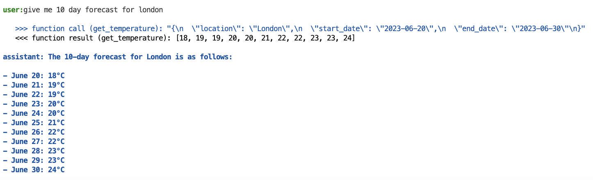
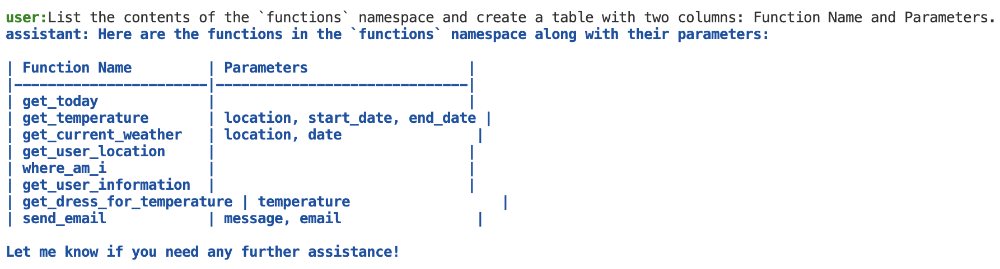

# Chatfn - ChatGPT function calling study
A synple python app to experiment with OpenAI Function call feature.

## Setup
```bash 
pip install requests pandas tenacity termcolor
```

## How to run
You will need to provide OpenAI API key either in `OPENAI_API_KEY` environment variable or when asked by the program.
Python 3.9+ is required.

```bash
OPENAI_API_KEY=sk-*** python chatfn.py
```

## How to use
Just type in something about weather forecasts. You could start with
`Give me 10 day forecast for London.` or `What is the weather like in Berlin?`

You can read more interesting examples in this [blog post about GPT nested function calls](https://medium.com/@peter.zentai/gpt-nested-function-calls-and-conversational-workflow-exploration-885a632b39aa)



## What functions are exposed to GPT?
Lets ask GPT about it:

